# HireFlow – Job Recruitment Management System

## Project Overview

HireFlow is a web-based Job Recruitment Management System developed using Django. It connects candidates, recruiters, and administrators on a single platform to simplify and manage the recruitment process.

The system provides role-based access and supports the complete recruitment workflow, from job posting and candidate applications to application tracking and interview scheduling.

## 🌐 Live Demo

**Live Website:** [Open HireFlow](https://kalandar897.pythonanywhere.com/)

**GitHub Repository:** https://github.com/kalandar897/HireFlow

## ⚙️ Installation and Setup

### Prerequisites
- Python
- pip
- Git

### Steps

1. Clone the repository:

   ```bash
   git clone https://github.com/kalandar897/HireFlow.git
   cd HireFlow
   ```

2. Create and activate a virtual environment:

   ```bash
   python -m venv venv
   ```

   Windows:

   ```bash
   venv\Scripts\activate
   ```

3. Install dependencies:

   ```bash
   pip install -r requirements.txt
   ```

4. Apply database migrations:

   ```bash
   python manage.py migrate
   ```

5. Create an administrator account:

   ```bash
   python manage.py createsuperuser
   ```

6. Start the development server:

   ```bash
   python manage.py runserver
   ```

7. Open http://127.0.0.1:8000/ in your browser.

## Technologies Used

- **Backend:** Python, Django
- **Frontend:** HTML, CSS, JavaScript
- **Database:** SQLite
- **Charts:** Chart.js
- **Development Tool:** Visual Studio Code

## User Roles

### Candidate

- Register and login
- Manage candidate profile
- Search and filter jobs
- Apply for jobs
- Upload resumes
- Submit cover letters
- Track application status
- View scheduled interviews
- Receive notifications

### Recruiter

- Register and login
- Create and manage jobs
- Edit and close jobs
- Review candidate applications
- View candidate profiles
- View resumes
- Update application status
- Schedule interviews
- Manage interviews

### Administrator

- Manage users
- Activate and deactivate users
- Manage jobs
- Activate and deactivate jobs
- Monitor applications
- View dashboard statistics
- Search and filter records
- Export application data as CSV

## Key Features

- User authentication and role-based access
- Candidate and recruiter dashboards
- Job search and location filtering
- Candidate profile management
- Resume and cover letter submission
- Duplicate application prevention
- Application status tracking
- Interview scheduling
- Interview status management
- In-app notifications
- Dashboard statistics and charts
- Search, filtering, and pagination
- CSV export for application records
- Job activation and deactivation
- Secure role-based access and ownership checks

## Project Structure

```text
HireFlow/
│
├── accounts/
│   └── User authentication and candidate profiles
│
├── jobs/
│   └── Job posting and recruiter management
│
├── applications/
│   └── Job application management
│
├── interviews/
│   └── Interview scheduling and management
│
├── notifications/
│   └── In-app notification management
│
├── templates/
│   └── HTML templates
│
├── static/
│   └── CSS and JavaScript files
│
├── media/
│   └── Uploaded resumes and files
│
├── config/
│   └── Django project configuration
│
├── manage.py
└── README.md

## Screenshots

### Home Page
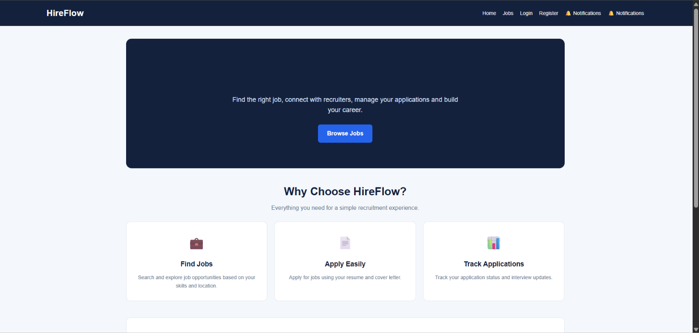

### Registration
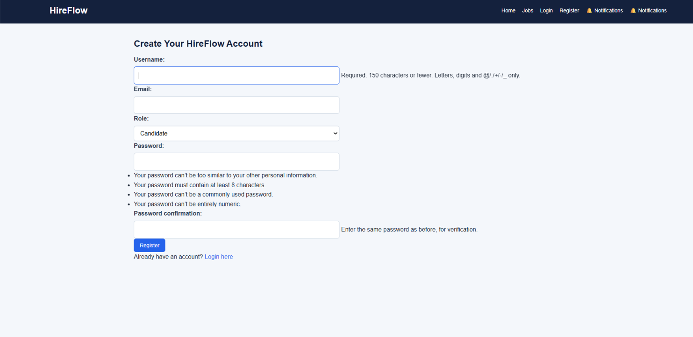

### Login
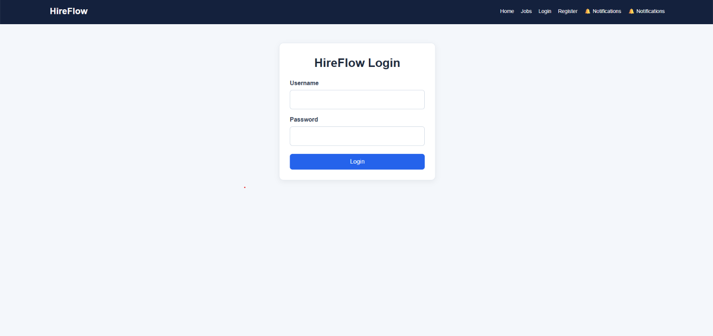

### Jobs Page
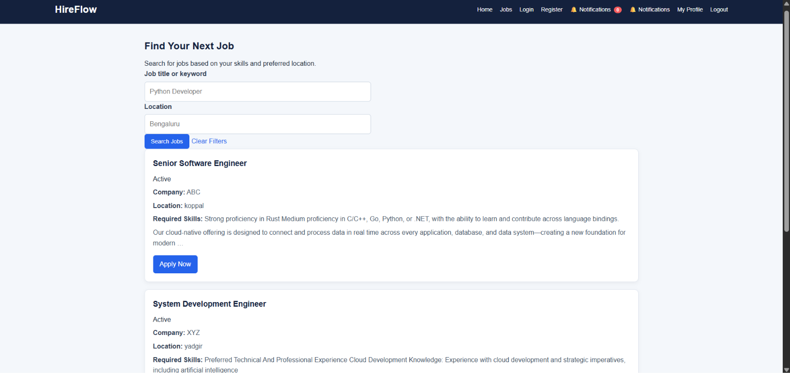

### Apply for Job
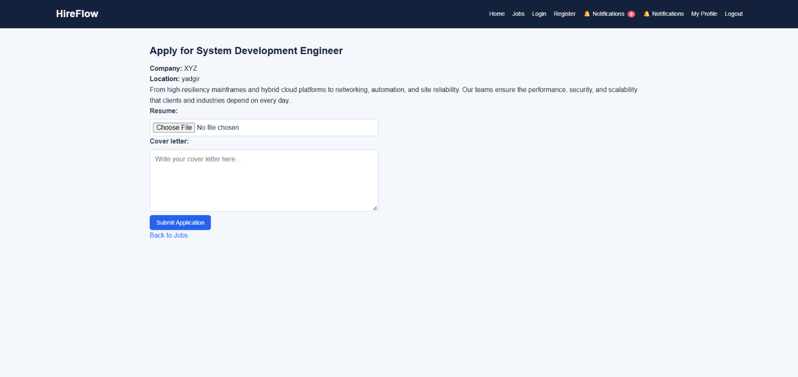

### Candidate Dashboard
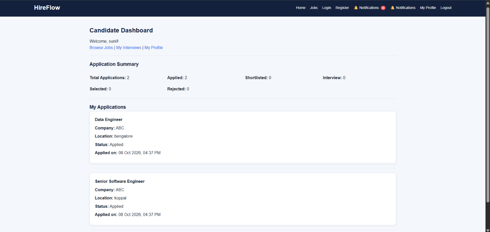

### Recruiter Dashboard
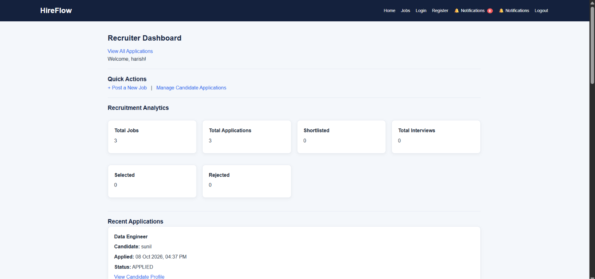

### Recruiter Applications


### Interview Scheduling
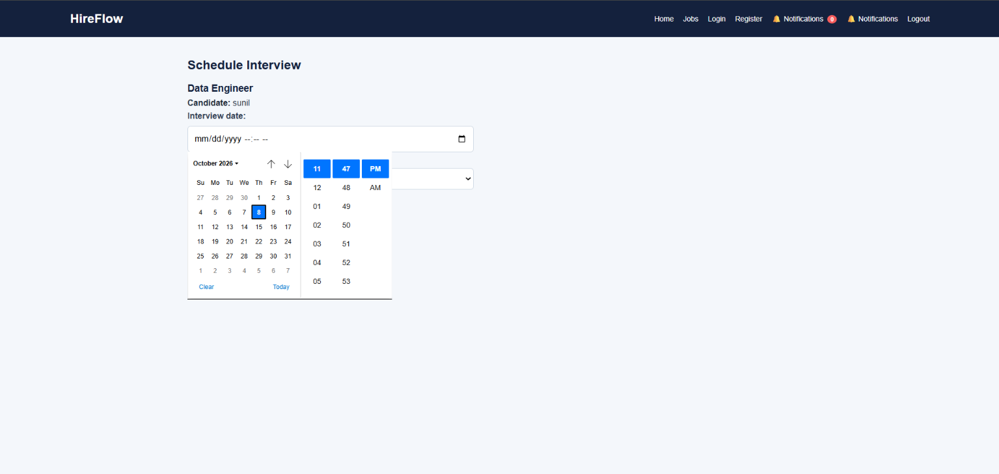

### Notifications
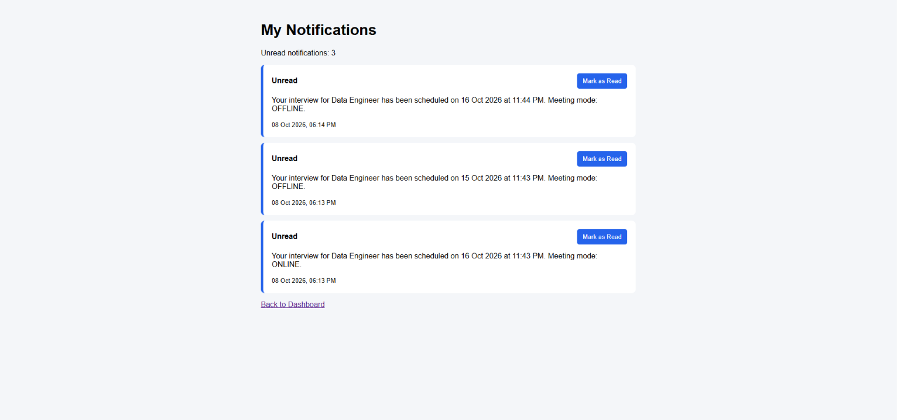

### Charts
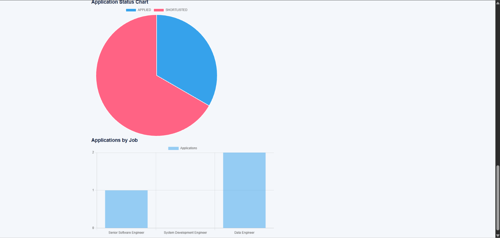

### Admin Dashboard
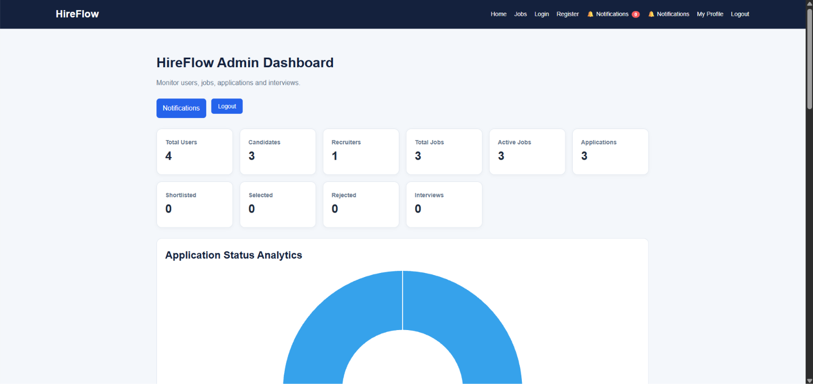

### Admin Dashboard - Users
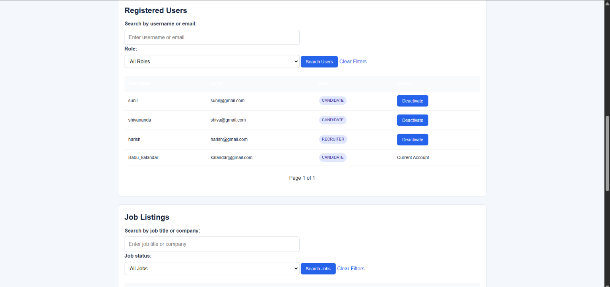

### Admin Dashboard - Applications
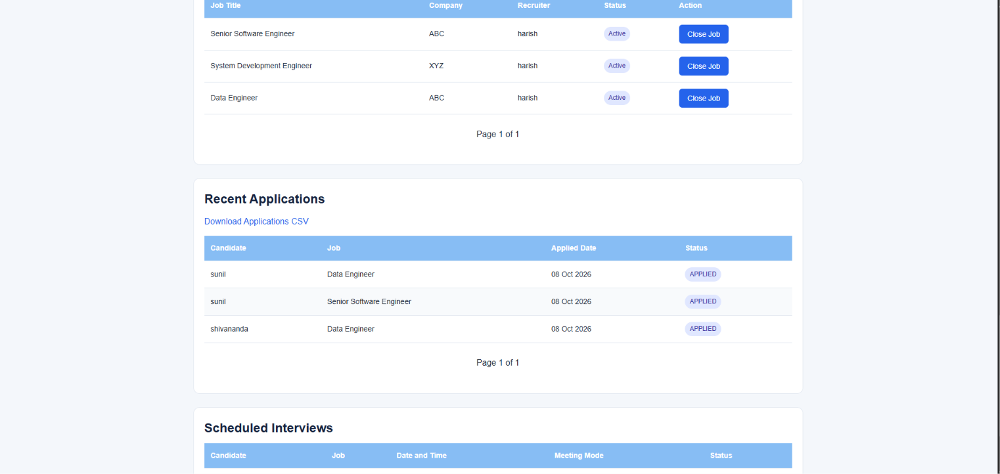
